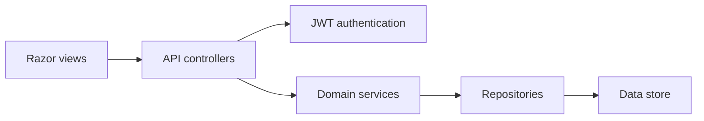

# Vitality Portal Architecture

The Razor pages retain the existing UI and are grouped by feature under `Views/Account`, `Views/Dashboard`, `Views/Network`, `Views/Income`, `Views/Wallet`, `Views/Commerce`, and `Views/Communications`. They call `/api` endpoints using the JWT issued by the login endpoint.

## Boundaries

- Controllers: HTTP, authorization, DTO binding, and response codes.
- Services: portal business rules and workflow coordination.
- Repositories: persistence contracts. The current implementation is in memory and can be replaced with EF Core repositories without changing controllers or services.
- DTOs: request/response contracts; entities are not returned directly.

## API Domains

Authentication, registration, profile, credentials, activation, dashboard, members, network, income, commissions, wallet, withdrawals, payouts, shopping, orders, messages, and meetings are independent backend sections.